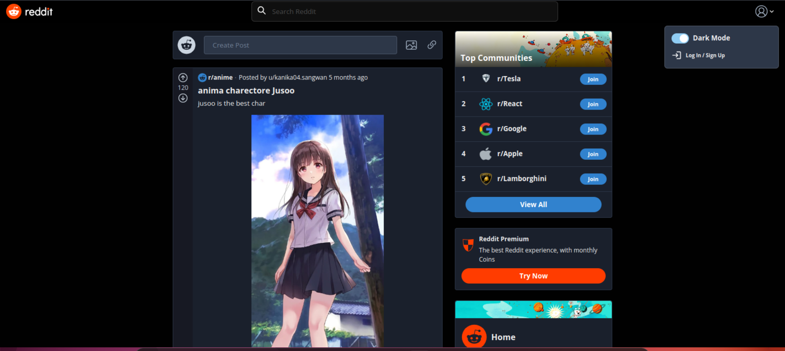

# Reddit Deployment 

## Project Overview

This project demonstrates how to deploy a Reddit clone application on **Kubernetes** using **Minikube**. The application consists of the following components:

- **Kubernetes Deployment**: Manages the lifecycle of the Reddit app pods.
- **Kubernetes Service**: Exposes the Reddit app within the Kubernetes cluster.
- **Ingress**: Provides external access to the Reddit app using a domain ( `hello.example.com`).

### Technologies Used

- **Kubernetes**: For orchestrating containers.
- **Docker**: For building the container images.
- **Minikube**: For local Kubernetes setup.
- **Kubectl**: For managing the Kubernetes resources.

---
### Source Code

The source code for the Reddit clone application can be found [here on GitHub](https://github.com/SashenJayathilaka/Reddit-Clone?tab=readme-ov-file).

## Prerequisites

Before proceeding with the project, make sure you have the following installed:

### 1. **Minikube**: Local Kubernetes Cluster
Install Minikube by following the instructions from the official documentation:  
[Minikube Install Guide](https://minikube.sigs.k8s.io/docs/)

### 2. **kubectl**: Kubernetes CLI
You’ll need `kubectl` to interact with your Kubernetes cluster. Install `kubectl` using this guide:  
[Kubectl Install Guide](https://kubernetes.io/docs/tasks/tools/install-kubectl/)

### 3. **Docker**: Build Reddit Docker Image
Install Docker to build the container image. You can follow the guide here:  
[Docker Install Guide](https://docs.docker.com/get-docker/)

---

